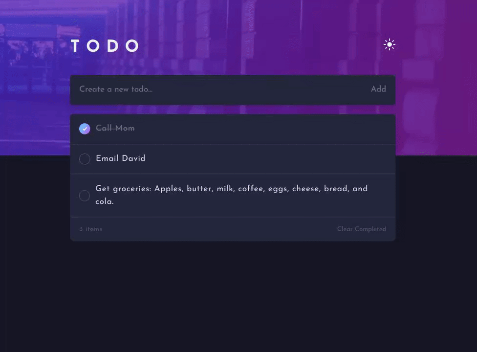
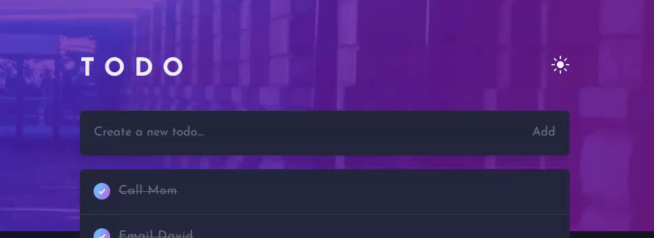
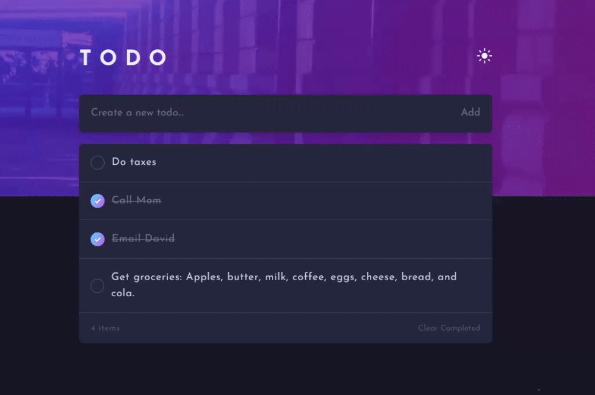
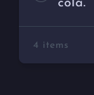
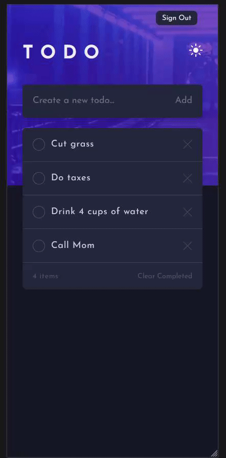

➡ **Try the [LIVE DEMO](https://todo-1xqqjv0u9-jordanadair.vercel.app/)** ⬅

# Table of Contents
1. [Introduction](#introduction)
2. [Home](#home)
3. [Adding & Deleting Todos](#add-delete)
4. [Mobile](#mobile)

## Introduction <a name="introduction"/>
I wanted to create this app to teach myself **TailwindCSS**, Google's **Firebase** database and authentication services, and **TypeScript**. I'm happy to say that I learned a lot about each of these tools during the creation of the app, and while it's not completely where I want it to be I am still quite happy with the result. 

## Home <a name="home"/> 

### 

When you log into the app you see a list of all the todos you've created. Each value is safely stored inside of Google's **Cloud Firestore** alongside your unique user identifier. This means that you can count on your todo list being there the next time you log in, and can use multiple accounts to create different todo lists.

You can also choose to view this list in either light or dark mode. This preference is stored on the browser so you don't have to keep changing it if you decide to create multiple accounts. 

## Adding & Deleting Todos <a name="add-delete"/>

### 

To add something to your todo list, you enter a value inside the bar above the list. You can then either click "Add", or hit enter to add it to your list, and the Cloud Firestore. 

### 

To delete todos you can either hit the "X" on individual items, or hit the "Clear Completed" button to delete every item from your list which you have marked as complete.

For Desktop users, the "X" will show up when they hover over each individual item, whereas mobile users can see each items "X" at all times. 

The list will keep track of how many items it contains.

### 

### 

## Mobile <a name="mobile"/> 

### 

This app is completely mobile responsive, with several different breakpoints to ensure that it looks great and functions perfectly on every device. 

➡ **Try the [LIVE DEMO](https://todo-1xqqjv0u9-jordanadair.vercel.app/)** ⬅
